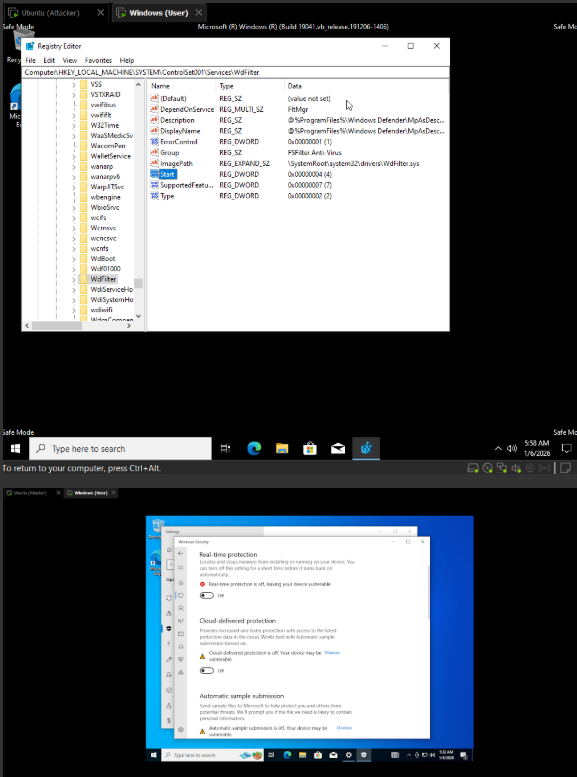
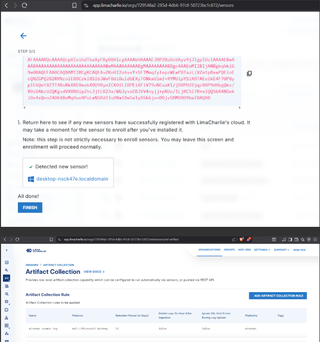
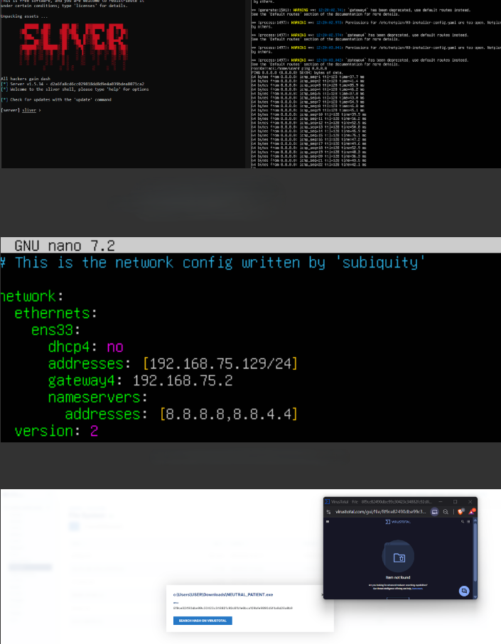
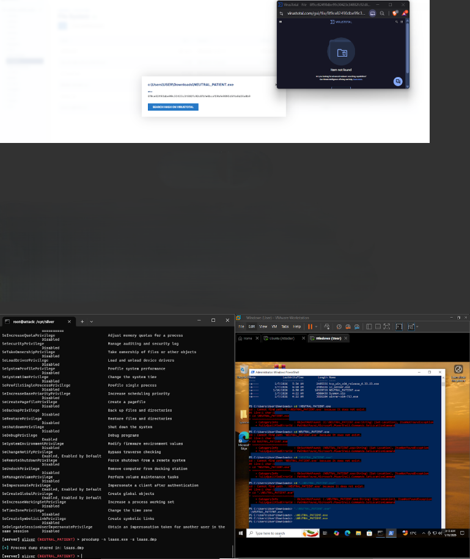
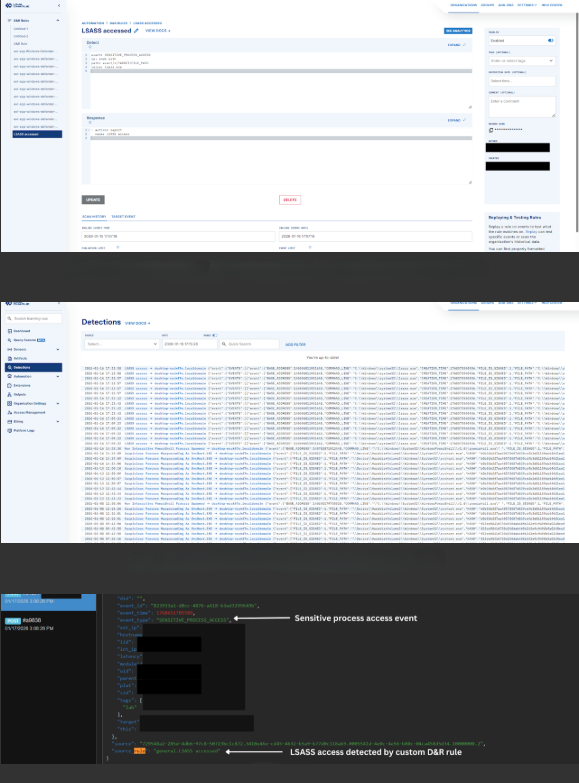

# SOC Home Lab: Endpoint Detection, C2 Simulation, and Incident Investigation

**Author:** Muzan Abbas

A SOC-style home lab built to simulate real-world attacker behavior and observe it from a defensive perspective. Configured a Windows endpoint with Sysmon and LimaCharlie EDR, generated attacker activity using a C2 framework (Sliver), and investigated the resulting telemetry to build custom detection rules.

---

## Lab Architecture

```
┌─────────────────┐                    ┌─────────────────┐
│   Attacker VM   │   C2 Connection    │   Victim VM     │
│  Ubuntu Server  │◀──────────────────▶│   Windows 10    │
│   Sliver C2     │                    │  Sysmon + EDR   │
└─────────────────┘                    └─────────────────┘
                                                │
                                                ▼
                                    ┌─────────────────────┐
                                    │   LimaCharlie EDR   │
                                    │  Centralized Console│
                                    │  Detection & Alerts │
                                    └─────────────────────┘
```

---

## Objectives

- Understand how endpoint logs are generated, collected, and analyzed by SOC analysts
- Simulate realistic post-exploitation attacker behavior in a controlled lab
- Investigate telemetry to identify malicious activity and indicators of compromise
- Build custom detection and response rules using real EDR tooling
- Develop troubleshooting and detection engineering skills

---

## Part 1 – Lab Setup

| Component | Details |
|---|---|
| Attacker VM | Ubuntu Server running Sliver C2 |
| Victim VM | Windows 10 |
| Endpoint Logging | Sysmon (SwiftOnSecurity config) |
| EDR Platform | LimaCharlie |

---

## Part 2 – Endpoint Hardening Changes (Preparing the Attack)



Windows Defender was disabled in both Safe Mode and the main OS, and the WdFilter registry entry was removed to allow execution of simulated C2 payloads that would otherwise be blocked. This reflects controlled lab conditions only and is not representative of best security practice.

---

## Part 3 – Telemetry Collection (Sysmon + LimaCharlie)



### Sysmon
Sysmon was installed using the SwiftOnSecurity configuration to generate high-fidelity telemetry including:

- Process creation events
- Network connections initiated by processes
- Parent-child process relationships
- Credential access activity (e.g., access to LSASS)

### LimaCharlie EDR
LimaCharlie was deployed to collect and centralize all endpoint telemetry:

- Native EDR telemetry (process execution, file activity, network activity)
- Sysmon event logs forwarded from the endpoint
- Timestamps, event types, and process context for investigation

### Why Sysmon Matters in a SOC Context

| Use Case | Value |
|---|---|
| Suspicious process behavior | Logs process creation with full command-line args |
| Malicious parent-child relationships | Captures process lineage |
| Credential access detection | Logs access to sensitive processes |
| Threat hunting | Enables timeline-based investigation |

---

## Part 4 – Adversary Simulation (Sliver C2)



- Sliver C2 server installed and configured on Ubuntu attacker VM
- Static IP (`192.168.75.129/24`) applied for consistent C2 communication
- Sliver implant generated and delivered to the Windows endpoint via temporary HTTP server
- C2 session established upon payload execution

### VirusTotal Result
The payload hash returned **zero detections** on VirusTotal, demonstrating that absence of AV detections does not imply a file is safe. This reinforces the importance of **behavior-based detection** over reputation-based approaches in a SOC context.

---

## Part 5 – Attack Execution and Telemetry Generation



With the C2 session active, the following attacker actions were performed to generate detectable telemetry:

| Action | Purpose |
|---|---|
| Remote command execution | Simulate post-exploitation activity |
| Privilege enumeration | Identify token privileges on the endpoint |
| LSASS process access | Simulate credential dumping technique |

---

## Part 6 – Detection Engineering and Alerting



### Custom Detection Rule
A custom detection and response rule was created in LimaCharlie to alert on unauthorized access to the LSASS process. The rule was validated by re-executing the attacker action and confirming alert generation.

### Telemetry Reviewed
- Suspicious process execution chains
- Outbound connections to the C2 server
- Credential access behavior targeting LSASS

### Webhook Output
A custom webhook was configured to forward detection alerts externally, demonstrating SOC automation and alerting integration concepts.

---

## Part 7 – Challenges and Troubleshooting

| Challenge | Resolution |
|---|---|
| VM networking and boot issues | Reconfigured network adapters and boot order |
| DNS and connectivity blocking payload transfer | Adjusted network settings and used direct IP |
| Tool installation dependencies | Resolved package conflicts manually |

---

## Key Takeaways

- Sysmon dramatically improves endpoint visibility beyond default Windows logging
- Behavior-based detection catches threats that signature-based tools miss
- A zero VirusTotal score does not mean a file is safe — context and behavior matter
- Custom detection rules allow SOC teams to tune defenses to their specific environment
- Hands-on lab work builds the troubleshooting instincts critical for real SOC operations
